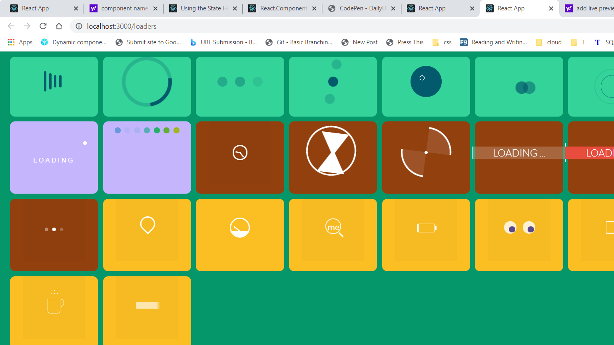

# React Loaders

This is a set of 26  React ready CSS loader components. The CSS and other resources are adapted from CodePen authors.
 
 

## List of loaders

* Minimalist
* Minimalist 2
* Element
* Others
# Requirements

* Nodejs
* Package manager `NPM / Yarn`
* TailwindCSS
* React
* Browser
* VS Code (optional)
# How to use the project

Clone the repo and install dependencies by running the `npm i` command then start the project with npm start

Alternatively you can donwload the repository and drag and drop the components from loaders folder to your project. Note that some of CSS must be adjusted for proper alignament since I used *tailwindCSS*
